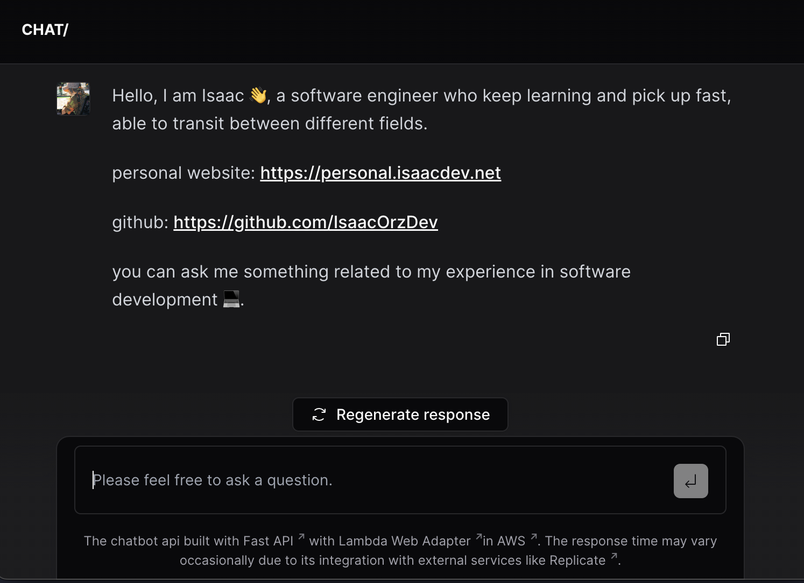

# [Personal Chat](https://chat.isaacdev.net)

A chatbot that introduce myself and answer questions related to my experience of software development.

The chatbot has been applyed [RAG](https://gpt-index.readthedocs.io/en/latest/getting_started/concepts.html), a common technique used to improve the performance of LLMs, it can better understand and respond to queries.

## Repositories

- [API Repo](https://github.com/IsaacOrzDev/personal-chat-api)

  
  

- [Portal Repo](https://github.com/IsaacOrzDev/personal-chat-portal)

  
  

- [Infrastructure Repo](https://github.com/IsaacOrzDev/personal-chat-pulumi)

  
  
